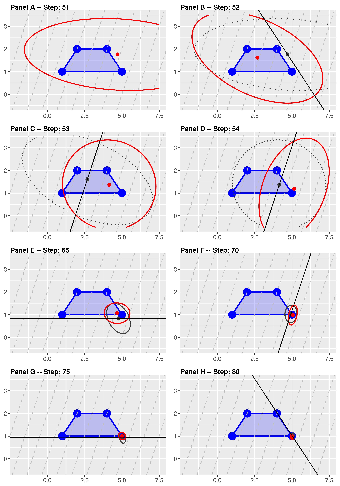

# Course project: Ellipsoid method and National Parks problem.
This repository contains most of my contributions to the Course project
for "MATH8100 Mathematical Programming" course I took Clemson University in December 2018.

Most of the material here is the main code and generated test-instances for the
"Ellipsoid algorithm" part of the project. For the "National Parks" problem I
was mostly doing web scraping in R.

If you have any questions -- please feel free to [reach
out](https://www.bochkarev.io/contact).

### Ellipsoid method
This is my implementation of the [Ellipsoid
method](https://en.wikipedia.org/wiki/Ellipsoid_method) for Linear Programs
(LPs). The idea is to search for an optimal solution in a sequence of shrinking
ellipses (while at each step we are guaranteed that an optimum is within the
ellipse). The convergence can be illustrated as follows:

More details are provided in the [relevant part](./ellipsoid-report.pdf) of the
course report (published with the course instructor's permission).

#### Technical details:
The code is mostly written in C++ and compiled under Linux with `armadillo` and `blas` libraries.
The sources files are in the [src](./Ellipsoid/src) folder:
- [ellipsoid.h](./Ellipsoid/src/ellipsoid.h) implements the main algorithm in
  `EllipsoidSolver` class,
- [ell-test.cpp](./Ellipsoid/src/ell-test.cpp) runs the algorithm against a test instance,
- [generate_tests.cpp](./Ellipsoid/src/generate_tests.cpp) is used to generate test instances,
- [vlogParser.R](./Ellipsoid/src/vlogParser.R) is used to generate figures (with R and ggplot2),
- other `.cpp` and `.m` files are auxiliary and are not necessary to implement
  the algorithm and/or reproduce the results .

Test cases data are in [data](./Ellipsoid/data/) folder, the plain-text format
of an instance is (hopefully) self-explanatory. Test runs are summarized in a
[table](./Ellipsoid/logs/tests.log), logs for specific runs can be found in
[logs](./Ellipsoid/logs/) folder.

All the commands used to compile the project and run the experiments are summarized in [Makefile](./Ellipsoid/Makefile) and the three corresponding `.sh`-files in the project [root](./Ellipsoid/).

### National Parks problem (no. 7)
The [problem folder](./NationalParks/) contains some relevant data and the
    auxiliary [code](./NationalParks/getParks.R) (in [R](https://www.r-project.org/)). 
